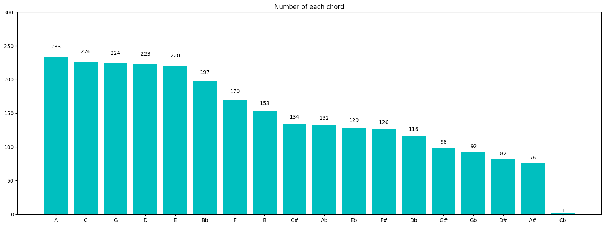
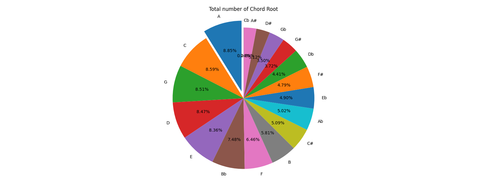
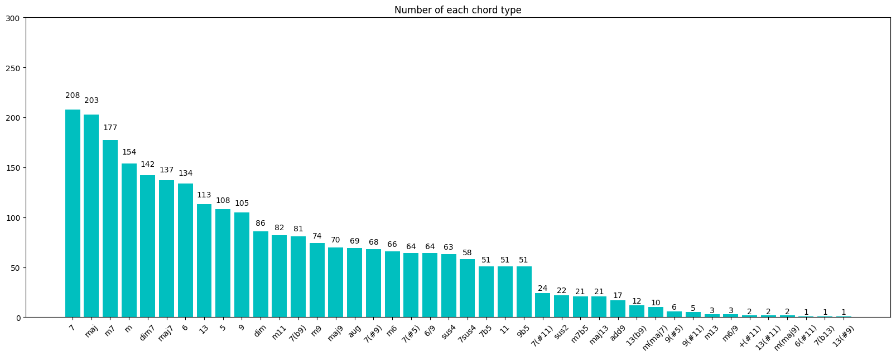
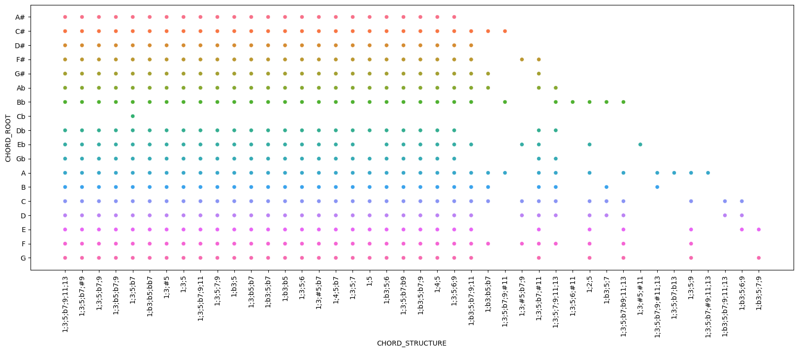
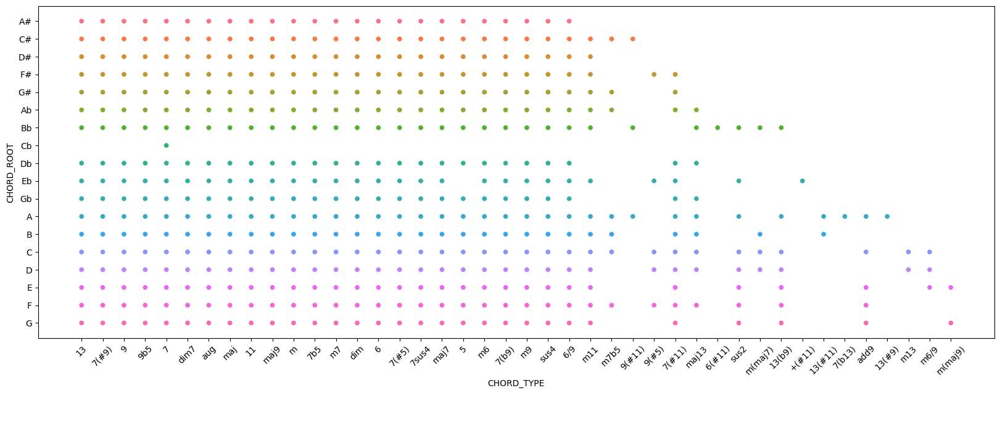
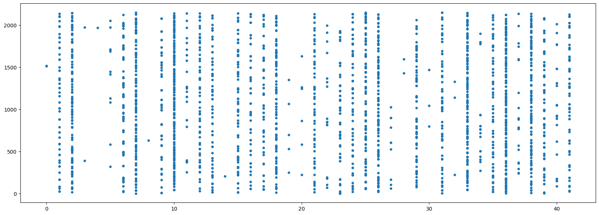
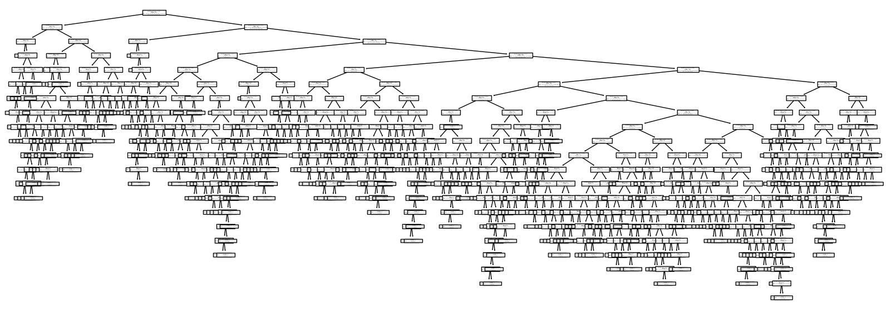
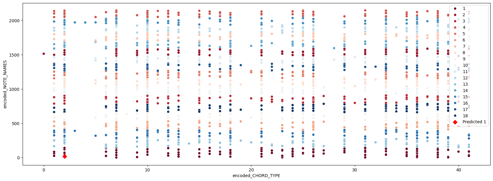

# Guitar Chord & Finger Positions: Machine Learning Analysis

[](https://www.python.org/)
[](https://scikit-learn.org/)
[](https://pandas.pydata.org/)
[](https://seaborn.pydata.org/)
[](https://jupyter.org/)

An applied machine learning project exploring the relationships between guitar fretboard fingerings, chord types, and musical pitch compositions. This study combines **Exploratory Data Analysis (EDA)**, **Supervised Classification (Decision Tree)**, and **Unsupervised Clustering (K-Means & Agglomerative Hierarchical Clustering)** to recognize and group guitar chords based on their physical mechanics and harmonic structure.

---

## Table of Contents

- [Project Overview](#project-overview)
- [Dataset & Feature Definitions](#dataset--feature-definitions)
- [Exploratory Data Analysis (EDA)](#exploratory-data-analysis-eda)
  - [1. Chord Root Distribution](#1-chord-root-distribution)
  - [2. Chord Type & Quality Distribution](#2-chord-type--quality-distribution)
- [Data Cleaning & Feature Engineering](#data-cleaning--feature-engineering)
  - [1. Feature Redundancy & Selection](#1-feature-redundancy--selection)
  - [2. Categorical Label Encoding](#2-categorical-label-encoding)
- [Supervised Learning: Decision Tree Classifier](#supervised-learning-decision-tree-classifier)
  - [1. Model Architecture & Training](#1-model-architecture--training)
  - [2. Decision Tree Visualization](#2-decision-tree-visualization)
  - [3. Evaluation & Inference Samples](#3-evaluation--inference-samples)
- [Unsupervised Learning: Clustering](#unsupervised-learning-clustering)
  - [1. Agglomerative Hierarchical Clustering](#1-agglomerative-hierarchical-clustering)
  - [2. K-Means Clustering ($K = 18$)](#2-k-means-clustering-k--18)
  - [3. Cluster Space Visualization](#3-cluster-space-visualization)
- [Key Results & Summary](#key-results--summary)
- [Project Structure](#project-structure)
- [Installation & Reproduction](#installation--reproduction)

---

## Project Overview

On a standard guitar fretboard, the same chord quality (e.g., _Major 7th_, _Minor_, _Dominant 7th_) can be voiced in multiple inversions, open strings, and movable barre shapes up and down the neck.

The primary objectives of this project are:

1. **Analyze Harmonic & Physical Relationships**: Discover patterns correlating chord types, fretboard finger placements, and constituent note names.
2. **Predict Chord Root** (`y = CHORD_ROOT`): Train a supervised **Decision Tree Classifier** that infers the chord root note given physical finger shapes, chord qualities, and active pitch collections.
3. **Discover Latent Groupings**: Apply **K-Means** and **Agglomerative Hierarchical Clustering** to explore how chords cluster organically in the encoded feature space.

---

## Dataset & Feature Definitions

The dataset (`data/chord-fingers.csv`) comprises **2,632 guitar chord voicings** recorded with semi-colon (`;`) delimiters:

| Feature Name       | Type        | Description                                                                                         | Sample Value                        |
| :----------------- | :---------- | :-------------------------------------------------------------------------------------------------- | :---------------------------------- |
| `CHORD_ROOT`       | Categorical | The fundamental root note / key of the chord (18 distinct root classes including sharps and flats). | `A#`, `C`, `G`, `Db`                |
| `CHORD_TYPE`       | Categorical | The harmonic quality/type of the chord (42 unique types).                                           | `maj`, `m`, `7`, `m7`, `dim7`, `13` |
| `CHORD_STRUCTURE`  | Categorical | Musical interval formula relative to root note.                                                     | `1;3;5`, `1;b3;5;b7;9`              |
| `FINGER_POSITIONS` | Categorical | Placements across the 6 guitar strings (`x` = muted, `0` = open string, `1-4` = finger index).      | `x,1,0,2,3,4`                       |
| `NOTE_NAMES`       | Categorical | Pitch names sounded across active strings.                                                          | `A#,C##,G#,B#,F##`                  |

---

## Exploratory Data Analysis (EDA)

### 1. Chord Root Distribution

The dataset encompasses 18 distinct root representations. The most prevalent roots are standard natural keys (`A`, `C`, `G`, `D`, `E`) which correspond directly with common guitar open tuning ergonomic chord shapes.

|                        Chord Root Frequency                         |                  Chord Root Proportion                   |
| :-----------------------------------------------------------------: | :------------------------------------------------------: |
|  |  |
|            _Figure 1: Total counts per chord root note._            | _Figure 2: Percentage share across all 18 chord roots._  |

- **Top Root Keys**: `A` (233 voicings, 8.85%), `C` (226 voicings, 8.59%), `G` (224 voicings, 8.51%), `D` (223 voicings, 8.47%), and `E` (220 voicings, 8.36%).
- **Rarest Root Keys**: `Cb` (1 voicing, 0.04%), `A#` (76 voicings, 2.89%), and `D#` (82 voicings, 3.12%).

---

### 2. Chord Type & Quality Distribution

The dataset spans 42 unique chord qualities ranging from basic triads to extended altered jazz chords:


_Figure 3: Distribution across all 42 chord types._

- **Dominant Voicings**: Dominant `7` (208 samples), Major `maj` (203 samples), Minor 7th `m7` (177 samples), and Minor `m` (154 samples).
- **Extended & Altered Voicings**: Chords like `dim7` (142), `maj7` (137), `6` (134), `13` (113), `5` (power chords, 108), and `9` (105).

---

## Data Cleaning & Feature Engineering

### 1. Feature Redundancy & Selection

A bivariate analysis comparing `CHORD_STRUCTURE` and `CHORD_TYPE` across `CHORD_ROOT` revealed an identical 1-to-1 mapping. Every musical interval formula in `CHORD_STRUCTURE` directly defines a unique `CHORD_TYPE`.

|                         CHORD_STRUCTURE vs CHORD_ROOT                          |                         CHORD_TYPE vs CHORD_ROOT                          |
| :----------------------------------------------------------------------------: | :-----------------------------------------------------------------------: |
|  |       |
|         _Figure 4: Scatter distribution of chord structure intervals._         | _Figure 5: Scatter distribution of chord type names (identical pattern)._ |

> [!NOTE]
> Because `CHORD_STRUCTURE` and `CHORD_TYPE` provide duplicate information, retaining both introduces multicollinearity without adding discriminatory power. Therefore, `CHORD_STRUCTURE` was dropped:
>
> ```python
> df = df.drop(['CHORD_STRUCTURE'], axis=1)
> ```

---

### 2. Categorical Label Encoding

All remaining categorical features were transformed into numerical values using Scikit-Learn's `LabelEncoder`:

```python
from sklearn.preprocessing import LabelEncoder

encoded_CHORD_ROOT = LabelEncoder().fit_transform(df['CHORD_ROOT'])
encoded_CHORD_TYPE = LabelEncoder().fit_transform(df['CHORD_TYPE'])
encoded_FINGER_POSITIONS = LabelEncoder().fit_transform(df['FINGER_POSITIONS'])
encoded_NOTE_NAMES = LabelEncoder().fit_transform(df['NOTE_NAMES'])
```

The resulting feature space reveals distinct clusters and coordinate densities:


_Figure 6: Encoded coordinate space (`encoded_CHORD_TYPE` vs `encoded_NOTE_NAMES`)._

---

## Supervised Learning: Decision Tree Classifier

### 1. Model Architecture & Training

A **Decision Tree Classifier** was chosen for its interpretability and natural handling of non-linear interactions between fret positions, active pitches, and chord qualities.

- **Target Variable ($y$)**: `CHORD_ROOT` (18 classes)
- **Predictor Variables ($X$)**:
  - `encoded_CHORD_TYPE`
  - `encoded_FINGER_POSITIONS`
  - `encoded_NOTE_NAMES`
- **Data Partition**: 80% Train, 20% Test (`train_test_split`, `test_size=0.2`)
- **Classifier**: `DecisionTreeClassifier()`

---

### 2. Decision Tree Visualization

The trained tree structure illustrates how the model hierarchically splits on fingering positions and pitch combinations to isolate chord roots:


_Figure 7: Full Decision Tree architecture showing decision paths and splits._

---

### 3. Evaluation & Inference Samples

The Decision Tree model achieved **75.71% test accuracy** on previously unseen chord configurations.

```text
Accuracy = 75.71157495256166 %
```

#### Sample Predictions:

| Sample Index | Input Features (`[TYPE, FINGERS, NOTES]`) | True Root | Model Prediction |  Result   |
| :----------: | :---------------------------------------: | :-------: | :--------------: | :-------: |
|    **#0**    |              `[2, 424, 17]`               |   `A#`    |       `A#`       | **Match** |
|  **#2627**   |             `[41, 450, 2026]`             |    `G`    |       `G`        | **Match** |

---

## Unsupervised Learning: Clustering

### 1. Agglomerative Hierarchical Clustering

Hierarchical clustering was performed to observe organic distance-based grouping:

- **Metric**: Euclidean Distance
- **Linkage**: Ward
- **Cluster Count**: $K = 18$

```python
from sklearn.cluster import AgglomerativeClustering

hierarchical_cluster = AgglomerativeClustering(
    n_clusters=18,
    metric='euclidean',
    linkage='ward'
)
labels = hierarchical_cluster.fit_predict(data)
```

---

### 2. K-Means Clustering ($K = 18$)

K-Means was trained on the 2D harmonic subspace (`encoded_CHORD_TYPE` and `encoded_NOTE_NAMES`) with $K = 18$, corresponding to the 18 root note families:

```python
from sklearn.cluster import KMeans

model_kmeans = KMeans(n_clusters=18, random_state=42)
encoded_df['Cluster'] = model_kmeans.fit_predict(
    encoded_df[['encoded_CHORD_TYPE', 'encoded_NOTE_NAMES']]
)
```

---

### 3. Cluster Space Visualization

The cluster assignments partition the harmonic feature space into distinct zones. To validate the clustering behavior, a sample coordinate `[2, 17]` (corresponding to **Row #0: `A#13`** chord with `encoded_CHORD_TYPE = 2` and `encoded_NOTE_NAMES = 17`) was evaluated, assigning it to **Cluster Group 1**:


_Figure 8: 18 K-Means clusters in the harmonic space, highlighting the sample query point `[2, 17]` (Row #0: `A#13`) marked by the red diamond (`Predicted 1`)._

---

## Key Results & Summary

| Stage / Component        | Metric / Specification    | Observation                                                               |
| :----------------------- | :------------------------ | :------------------------------------------------------------------------ |
| **Dataset Size**         | 2,632 samples             | Zero missing values across all records.                                   |
| **Feature Optimization** | Dropped `CHORD_STRUCTURE` | Avoided redundant multicollinearity with `CHORD_TYPE`.                    |
| **Supervised Accuracy**  | **75.71%**                | Strong classification accuracy across 18 multi-class chord root targets.  |
| **Clustering ($K=18$)**  | K-Means & Agglomerative   | Partitions note and chord combinations into structured harmonic clusters. |

### Practical Takeaways:

- **Ergonomics & Voicings**: Guitar chords naturally exhibit clustering based on open-string fingerings and barre chord positions.
- **Physical Fingerings as Features**: Combining string finger positions with pitch names provides high predictive power for identifying chord root keys.

---

## Project Structure

```text
guitar-chord-classification/
├── data/
│   └── chord-fingers.csv                     # Original dataset (2,632 chord records)
├── docs/
│   └── images/                               # Exported visualizations and plots
│       ├── chord_root_distribution.png       # Bar chart: chord root frequencies
│       ├── chord_root_pie.png                # Pie chart: chord root percentages
│       ├── chord_type_distribution.png       # Bar chart: 42 chord types distribution
│       ├── decision_tree_structure.png       # Full Decision Tree diagram
│       ├── encoded_feature_scatter.png       # Encoded 2D feature scatter plot
│       ├── feature_chord_type_vs_notes.png   # Chord type vs note names scatter
│       ├── feature_finger_positions_vs_chord_type.png # Finger positions vs chord type
│       ├── feature_redundancy_chord_structure.png# Bivariate structure redundancy plot
│       ├── feature_redundancy_chord_type.png # Bivariate type redundancy plot
│       └── kmeans_clusters.png               # K-Means 18-cluster result with prediction
├── notebooks/
│   └── chord_fingers.ipynb                   # Complete Jupyter Notebook (EDA, ML, Visuals)
└── README.md                                 # Comprehensive project documentation
```

---

## Installation & Reproduction

### 1. Clone the Repository

```bash
git clone https://github.com/kengmaikinpak/guitar-chord-classification.git
cd guitar-chord-classification
```

### 2. Create and Activate a Virtual Environment

```bash
# Windows
python -m venv venv
.\venv\Scripts\activate

# macOS / Linux
python3 -m venv venv
source venv/bin/activate
```

### 3. Install Dependencies

```bash
pip install pandas numpy scikit-learn matplotlib seaborn scipy jupyter
```

### 4. Run the Jupyter Notebook

```bash
jupyter notebook notebooks/chord_fingers.ipynb
```

Execute the notebook cells sequentially to reproduce the data preprocessing, model training, evaluation metrics, and visual plots.

---

## Authors & Acknowledgments

Developed as an academic project for **CE223 Computer Programming II** at Bangkok University.

- **Apisit Suansane** ([@kengmaikinpak](https://github.com/kengmaikinpak))
- **Naparut Kaomoon** ([@naparutkaomoon](https://github.com/naparutkaomoon))
- **Thanakirt Kaewkhiaw** ([@Tnk2202](https://github.com/Tnk2202))
